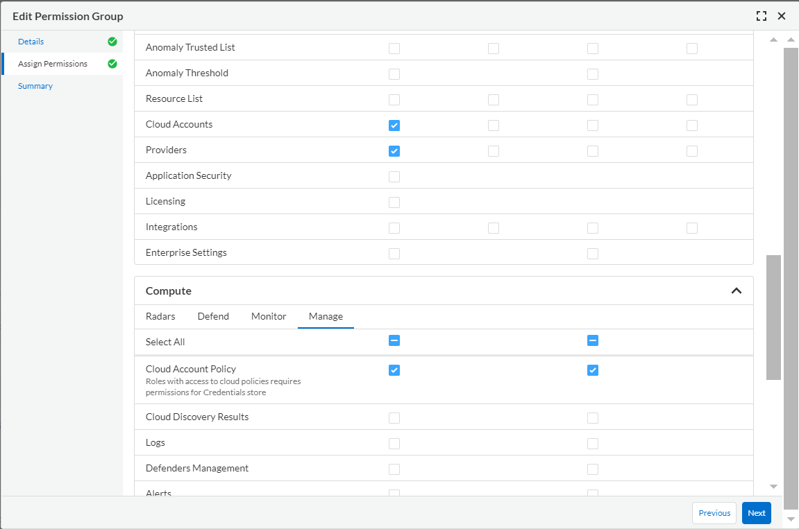

# Prisma Cloud Compute Agentless Configuration

Prisma Cloud Compute API management of Cloud Accounts, specifically around scanning VMs, Containers and Serverless Functions using agentless features ([Agentless Scanning](https://docs.prismacloud.io/en/enterprise-edition/content-collections/runtime-security/agentless-scanning/agentless-scanning) for VMs and Containers, and [Serverless Scanning](https://docs.prismacloud.io/en/enterprise-edition/content-collections/runtime-security/vulnerability-management/scan-serverless-functions) for Functions).

This script is meant for updating serverless and agentless configuration for multiple cloud accounts inside a Organization, Account Group or individual accounts. It works for SaaS and self-hosted versions of Prisma Cloud Compute.

## Requirements

1. Cloud account must be already onboarded by Prisma Cloud
2. Python version 3.11 or later if the script is executed locally

## Least privilege permissions

### Prisma Cloud SaaS version

In order to grant the least privileges to a user or service account in the SaaS version of Prisma Cloud, you must create a Permissions Group with View and Update for the Cloud Account Policy permission. While you are creating a Permissions Group, the Cloud Account Policy permission can be found under **Assing Permissions** > **Compute** > **Manage** as in the following image:


If you required to pull the data of the accounts existing on onboarded organization, then the required permissions are as following:



Once created this permissions group, you must create a role and then the belonging user or service account.

> **NOTE**
>
> * You must assing an account group to the role. Be sure to add the account groups of the accounts you need to modify.
> * Is recommended to use a service account and access key.

### Prisma Cloud self-hosted version

In order to grant the least privileges to a user in the self-hosted version of Prisma Cloud, you must create a role with Read and Write for the Cloud Account Policy permission and no access to the Console IU. While you are creating a Role, the Cloud Account Policy permission can be found under the Manage tab as in the following image:


Once created this role, you must create the belonging user.

## Process

### Step1: Install Dependencies

Install dependencies file with the following command:

`$ pip install -r requirements.txt`

It's recommended to use a virtual environment.

> **NOTE**
>
> * This script was tested in Python 3.10 and pip version 22.3.1.

### Step 2: Set up Configuration File

In this repository, it exists a file named **config.json**. This is the one used for setting up all the parameters required for agentless and serverless. These parameters are:

```json
{
    "findInOrg": false, - If true, if an account group is set (which will ignore the org) will look if the account exist inside the onboarded org 
    "debug": true, - Set to debug mode. It will print additional information 			- 
    "limit": 50, - Limit of accounts that can be retrieved from Prisma Cloud. Maximum 50
    "bulkUpdateCount": 20, - How many accounts can be updated at once
    "accountSets": [
        {
            "changeStateOnly": false, - This means that will only enable agentless or serverless
            "organizationId": "", - Id of the org. This parameter will be ignored unless the findInOrg is being used
            "organizationType": "", - Type of org. Can be only aws, azure or GCP
            "accountGroups": [], - Name of the account group. Not required if organizationId or accountIds is set
            "accountIds": [], - Ids of the individual accounts to be onboarded. Not required if accountGroups or accountIds is set
            "credentials": "", - Environment variable to store credentials to be updated in Prisma. Only available for Azure
            "onboardingMode": "org", - The way that the accounts were onboarded. Can be single or org
            "scanMode": "target", - Type of accounts to be modified. target: accounts in same account mode (for new accounts in org). scannedByHub: accounts in Hub Mode. (blank): all accounts
            "agentless": {
                "hubAccountId": "", - Id of the Hub Account. Required if changing the Org or Account Group to Hub
                "subnetName": "", - Name of the Subnet
                "securityGroupName": "", - Name of the security group
                "excludeTags": [], - Resources to be excluded for specific tag. The format should be the same as the customTags key
                "includeTags": [], - Resources to be included for specific tag. The format should be the same as the customTags key
                "customTags": [ - tags to be added to the created resources. If none leave empty list like excludeTags key
                    {
                        "key": "",
                        "value": ""
                    }
                ],
                "regions": [], - Codes of the regions to be scanned
                "scanners": 0, - Ammount of scanners
                "scanNonRunning": "false", - Scan non running hosts
                "autoScale": "true", - Enable autoscaling
                "enforcePermissionsCheck": "true", - Enforce permissions verification 
                "ociExcludedCompartments": [], - Excluded OCI comparments (only for OCI)
                "ociVcn": "", - Configure the OCI VCN
                "setAsHub": "", - Set the accounts as Hub. Not required
                "agentlessState": "" - Enable or Disable agentless. Values "enabled" or "disabled"
            },
            "serverless": {
                "scanLatest": "true", - Scan only the latest Function version
                "scanCap": "0", - The Maximum amount of functions to be scanned per account. If "0" means all
                "scanLayers": "true", - Scan the lambda layers of the function. Only for AWS
                "radarCap": 0, - How many functions will be on the radar. If set to 0 means no change which will take the default value of 20
                "radarLatest": "true", - get the radar view of only the latest functions
                "serverlessState": "" Enable or Disable serverless scan. Values "enabled" or "disabled"
            }
        }
    ]
}
```

You can add multiple entries to the accountSets key to modify multiple orgs or account groups at once. Here is an example:

```json
{
    "findInOrg": false,
    "debug": true,
    "limit": 50,
    "bulkUpdateCount": 20,
    "accountSets": [
        {
            "changeStateOnly": false,
            "organizationId": "0123456789",
            "organizationType": "aws",
            "accountGroups": [],
            "accountIds": [],
            "credentials": "",
            "onboardingMode": "org",
            "scanMode": "target",
            "agentless": {
                "hubAccountId": "1111156789",
                "subnetName": "my-subnet",
                "securityGroupName": "my-sg",
                "excludeTags": [],
                "includeTags": [],
                "customTags": [
                    {
                        "key": "REQUIRED_TAG",
                        "value": "required-value"
                    }
                ],
                "regions": ["us-east-1","us-east-2"],
                "scanners": 0,
                "scanNonRunning": "false",
                "autoScale": "true",
                "enforcePermissionsCheck": "true",
                "ociExcludedCompartments": [],
                "ociVcn": "",
                "setAsHub": "",
                "agentlessState": ""
            },
            "serverless": {
                "scanLatest": "true",
                "scanCap": "0",
                "scanLayers": "true",
                "radarCap": 0,
                "radarLatest": "true",
                "serverlessState": ""
            }
        },
        {
            "changeStateOnly": false,
            "organizationId": "",
            "organizationType": "gcp",
            "accountGroups": ["My Account Group"],
            "accountIds": [],
            "credentials": "",
            "onboardingMode": "org",
            "scanMode": "target",
            "agentless": {
                "hubAccountId": "my-gcp-hub-account",
                "subnetName": "",
                "securityGroupName": "",
                "excludeTags": [],
                "includeTags": [
                    {
                        "key": "Environment",
                        "value": "PROD"
                    }
		],
                "customTags": [],
                "regions": [],
                "scanners": 0,
                "scanNonRunning": "false",
                "autoScale": "true",
                "enforcePermissionsCheck": "true",
                "ociExcludedCompartments": [],
                "ociVcn": "",
                "setAsHub": "",
                "agentlessState": ""
            },
            "serverless": {
                "scanLatest": "true",
                "scanCap": "0",
                "scanLayers": "true",
                "radarCap": 0,
                "radarLatest": "true",
                "serverlessState": ""
            }
        }
    ]
}
```

### Step 3: Environment variables

This script uses the following environment variables:

| Variable             | Default     | Description                                                                                                                              |
| -------------------- | ----------- | ---------------------------------------------------------------------------------------------------------------------------------------- |
| PRISMA_USERNAME      | -           | Access Key of the service account                                                                                                        |
| PRISMA_PASSWORD      | -           | Secret Key of the service account                                                                                                        |
| PRISMA_API_ENDPOINT  | -           | [API endpoint](https://pan.dev/prisma-cloud/api/cspm/api-urls/) of the CSPM console                                                         |
| COMPUTE_API_ENDPOINT | -           | [API endpoint](https://pan.dev/prisma-cloud/api/cwpp/access-api-saas/) of the Compute Console. Not required if PRISMA_API_ENDPOINT is set |
| CONFIG_FILE          | config.json | Name of the configuration file                                                                                                           |

You can either use it as an OS environment variable or write a **.env** file with this variables included.

### Step 4: Run script

To run this script locally, create the **.env** file with the required environment variables and run the following command:

```bash
python configAccountSets.py
```

To run it on a pipeline, use the file of **azure-pipelines.yml** for your reference

## Agentless Host Status Check

To review whether the hosts are being scanned successfully, with the enviroment variables in place, run the following command.

```bash
python hostStatusReport.py
```

This will generate a report of the scan status of the hosts.
