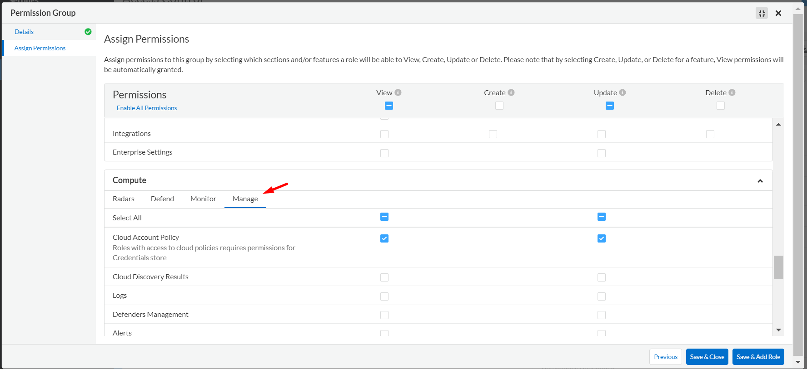
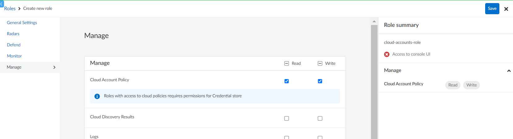

# Prisma Cloud Compute API Agentless
Prisma Cloud Compute API management of Cloud Accounts, specifically around agentless. 

This script is meant for updating agentless configuration for multiple cloud accounts for agentless scanning in **Same Account** mode. It also works for SaaS and self-hosted versions of Prisma Cloud Compute.

## Usage
Here is general view of the script and all it's parameters:

```$ python3 configAgentless.py --account-ids $ACCOUNT_1 $ACCOUNT_2 ... $ACCOUNT_N --username $PRISMA_USERNAME --password $PRISMA_PASSWORD --compute-api-endpoint $COMPUTE_API_ENDPOINT --subnet-name $SUBNET_NAME --security-group-name $SECURITY_GROUP_NAME --auto-scale true/false --regions $REGION_1 $REGION_2 ... $REGION_N --include-tags/--exclude-tags $TAG_1=VALUE_1 $TAG_2=VALUE_2 ... $TAG_N=VALUE_N --custom-tags $CUSTOM_TAG_1=VAlUE_1 $CUSTOM_TAG_2=VAlUE_2 ... $CUSTOM_TAG_N=VAlUE_N --scan-non-running true/false --scanners N --skip-tls-verify```

### Parameters
* ```--account-ids``` (required): Ids of the cloud accounts you want to set the parameters of agentless scanning. The account must be onboarded already by Prisma Cloud and agentless scanning should be already enabled.
* ```--username``` (required): Name of the user to be used. For Prisma Cloud SaaS version, this would be the value of the Access Key ID if you are using access keys.
* ```--password``` (required): Password of the user to be used. For Prisma Cloud SaaS version, this would be the value of the Secret Key if you are using access keys.
* ```--compute-api-endpoint``` (required): API endpoint of the Prisma Cloud Compute console. For SaaS version, you can find this in the Compute console under **Manage** > **System** > **Utilities**. 
* ```--subnet-name``` (optional): Name of the subnet to be used for agentless scanning spot instance. The subnet must have been created in the cloud account.
* ```--security-group-name``` (optional): Name of the security group to be used for agentless scanning spot instance. The security group must have been created in the cloud account.
* ```--auto-scale``` (optional): Enables or disables autoscaling for agentless scanning spot instances. It can only be **true** or **false**.
* ```--regions``` (optional): Scope of regions to be scanned. The region code must be used (eg. us-east-1 for AWS North Virginia).
* ```--include-tags``` (optional): Scope of instances to be included in the scan by the tags they have. This must not be used together with the parameter ```--exclude-tags```. The format of each tag should be **key=value**. Once used, it will remove the excluded tags in the agentless configuration.
* ```--exclude-tags``` (optional): Scope of instances to be excluded from the scan by the tags they have. This must not be used together with the parameter ```--include-tags```. The format of each tag should be **key=value**. Once used, it will remove the included tags in the agentless configuration.
* ```--custom-tags``` (optional): Tags that will be added to the agentless scanning spot instance. The format of each tag should be **key=value**.
* ```--scan-non-running``` (optional): Enables or disables the scanning of non running instances in your cloud environment. It can only be **true** or **false**.
* ```--scanners``` (optional): Maximum number of scanner spot instances to be deployed on the cloud. It's maximum value is **10**.
* ```--skip-tls-verify``` (optional): Skip TLS verification of the Compute API Endpoint.

> **NOTE**
> * If an optional parameter is not included, the value of it will remain the same as it was configured before. 
> <br/><br/>

### Environment variables
Instead of explicitly input the values of some parameters in the script, you can substitute them by using environment variables. Those variables are:

|       Variable       |     Parameter substituted    |
|----------------------|------------------------------|
|    PRISMA_USERNAME   |       ```--username```       |
|    PRISMA_PASSWORD   |       ```--password```       |
| COMPUTE_API_ENDPOINT | ```--compute-api-endpoint``` |
|     SUBNET_NAME      |      ```--subnet-name```     |
|  SECURITY_GROUP_NAME |  ```--security-group-name``` |
|      SKIP_VERIFY     |   ```--skip-tls-verify```    |

You can either use it as an OS environment variable or write a .env file with this variables included, but if the parameter is input while running the script, this will override the environment variable.

The value of SKIP_VERIFY must be 0 or 1.

## Least privilege permissions
### Prisma Cloud SaaS version
In order to grant the least privileges to a user or service account in the SaaS version of Prisma Cloud, you must create a Permissions Group with View and Update for the Cloud Account Policy permission. While you are creating a Permissions Group, the Cloud Account Policy permission can be found under **Assing Permissions** > **Compute** > **Manage** as in the following image:



Once created this permissions group, you must create a role and then the belonging user or service account.

>**NOTE**
> * You must assing an account group to the role. Any account group will work. 
> * Is recommended to use a service account and access key.
> <br/><br/>

### Prisma Cloud self-hosted version
In order to grant the least privileges to a user in the self-hosted version of Prisma Cloud, you must create a role with Read and Write for the Cloud Account Policy permission and no access to the Console IU. While you are creating a Role, the Cloud Account Policy permission can be found under the Manage tab as in the following image:



Once created this role, you must create the belonging user.

## Install dependencies
Install requirements:

`$ pip install -r requirements.txt`

It's recommended to use a virtual environment.

> **NOTE** 
> * This script was tested in Python 3.10 and pip version 22.3.1.
> <br/><br/>

## CloudFormation template
A cloudFormation template has been added to this repo with the purpose of creating the VPC, subnet and security group for the agentless scanning spot instances on an entire AWS Organization, or on certain organization units, with the minimum required inbound and outbound rules for the security group in order to successfully connect to the Prisma Cloud Compute console. 

This template is under the **AWS** folder of this repo and is named as **agentlessSubnetSGTemplate.yaml**.

The parameters of this template are:
* VpcCidr: The Cidr Block of the VPC to be created. Default value: 10.0.0.0/16
* SubnetName: The name of the subnet to be created. Default value: prismacloud-agentless-subnet
* SubnetCidr: the Cidr Block of the subnet. Default value: 10.0.0.0/24
* SecurityGroupName: The name of the security group to be created. Default value: prismacloud-agentless-sg
* SecurityGroupEgress: IP address of the Prisma Cloud Compute console. For Prisma Cloud SaaS version, it must be the same as the Egress IP of the Compute SaaS console for the Prisma Cloud tenant you are currently using. To get this IP address, follow up our documentation in doc of [Enable Access to the Prisma Cloud Console](https://docs.prismacloud.io/en/classic/cspm-admin-guide/get-started-with-prisma-cloud/enable-access-prisma-cloud-console). Default value: 34.75.54.101/32 (APP and APP2 Prisma Cloud tenants)
* OrganizationalUnitIds: List of organization Units to be applied this template. Provide the organizational root OU ID (Prefix like r-) if you want to run it for all the accounts under this Organization, else provide a comma-separated list of OU ids(Prefix like ou-).

### Requirements
To apply such template is required to enable **Trusted access for AWS Account Management** if you have not previously enabled it. For that follow this steps:
1. Sign in to your AWS Organization management account. You must sign in as an IAM user, assume an IAM role, or sign in as the root user (not recommended) in the organization’s management account.
2. Select **AWS Organizations** from the list of Services.
3. Click **Services** from the left navigation pane.
4. Choose **AWS Account Management** from the list of services.
5. Select **Enable trusted access**.
6. Click Services again and choose CloudFormation StackSets from the list of services.
7. Select **Enable trusted access**.

### Applying the template
You can apply the template from the AWS Console on **CloudFormation** > **Stacks** > **Create Stack** or downloading the template file and applying it via AWS CLI:

 `$ aws cloudformation create-stack --stack-name agentless-scanner --template-body file:///agentlessSubnetSGTemplate.yaml --parameters ParameterKey=OrganizationalUnitIds,ParameterValue=r-0000 --region us-east-1`

You must add any other parameter if you want to override any default value and change the value of OrganizationalUnitIds.

### Integrate template with script
In order to integrate this template once applied with the ```configAgentless.py``` script, first you need to get the account ids where the stack was applied by running de following commands:

`$ ROOT_ACCOUNT=$(aws sts get-caller-identity --query "Account" --output text)`

`$ MEMBER_ACCOUNTS=$(aws cloudformation list-stack-instances --stack-set-name agentless-scanner | jq -c '.Summaries[].Account' | sed -e 's/"//g')`

Once done you can run the script as follows:

`$ python3 configAgentless.py --account-ids $ROOT_ACCOUNT $MEMBER_ACCOUNTS --subnet-name prismacloud-agentless-subnet --security-group-name prismacloud-agentless-sg ...OTHER_PARAMETERS`

> **NOTE** 
> * The last commands assumed that you are using the CloudFormation template default values and you have installed the JSON Processor **jq**.
> * All the commands can be run as is in bash shell or Z shell. 
> * Pending GCP and Azure subnet and security group implementation 
> <br/><br/>